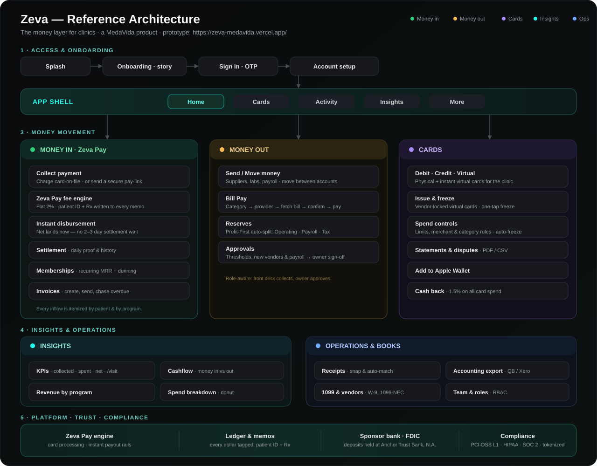

# Zeva — Product Brief

**The money layer for clinics.**
A MedaVida product.

**Live prototype →** https://zeva-medavida.vercel.app/
*Clickable, mobile-first prototype. Best viewed on a phone; tap once on load to enable the metallic motion cards. Ships in dark mode with a full light theme (switch under More → Appearance).*

---

## What Zeva is

Zeva is the money operating system for US clinics — the layer that moves, tracks, and separates every dollar a clinic earns and spends. It is **not an EMR**; it sits beside the clinical record and owns the money.

Two directions of money, one app:

- **Money in — Zeva Pay.** Patients pay from a card on file. Zeva's in-house payment layer, Zeva Pay, charges the card, takes a flat **2% fee**, and **disburses the net to the clinic instantly** — no 2–3 day settlement wait. Every payment carries the patient ID and medication/program in the memo, so revenue is itemized by patient and by program from the first tap.
- **Money out.** A clinic debit and credit card for suppliers, labs, rent, and payroll, plus built-in bill pay, spend controls, approvals, and reserves.

**Market:** US · **Currency:** USD.

---

## Design references

The product's feel is drawn from the most tactile, trusted money apps in the world:

| Reference | What we took |
|---|---|
| **Jupiter** | Clean neobank flows, card-first home, friendly money storytelling. |
| **Fi** | Insights and money-movement UX; calm information density. |
| **Ramp** | Business spend controls, approvals, and accounting-grade rigor. |

Signature Zeva touches layered on top: a **metallic gyroscope card** that tilts to real device motion, a **living logo**, liquid-glass surfaces, a teal fill-only accent, scroll-driven storytelling, and a fully considered **light + dark** system.

---

## App architecture

*Entry (Splash → Onboarding → Sign-in) leads into the App Shell and its five tabs. **Home** fans out to the two money directions — **Money In · Zeva Pay** and **Money Out** — while **More** houses **Operations & Books**.*

---

## Sections & what each does

### Onboarding & sign-in
- **Splash + Onboarding** — a short, swipeable story that frames the clinic-money problem and the instant-money promise.
- **Sign in** — mobile number + 6-digit OTP. Fast, passwordless, the neobank standard.

### Home
The card-first dashboard. The clinic card leads; a scroll-driven panel lifts to reveal balance and actions.
- **Card wallet** — swipe to cycle cards; the card tilts with device motion (metallic feel).
- **Quick actions** — Collect, Send, Bill Pay, Cards.
- **Highlights** — instant payout, GLP-1 program growth, upcoming rent, net cashflow.
- **Recent activity** — the latest money movements, itemized by patient/vendor.

### Cards
- Card carousel (debit + credit), freeze/unfreeze, add to Apple Wallet, statements, dispute a charge.
- Controls: show card number, set PIN, spend controls (limits, merchant/category rules), auto-freeze on suspicious activity.
- Issue a virtual card instantly, restricted to chosen vendors.

### Activity
- The full money ledger with search (patient ID, vendor, medication) and filters (money in/out, patients, suppliers, bills).
- Tap any item for a detail sheet — amount, patient/Rx, category, card, settlement status.

### Insights
- Period filter (month/quarter/year), KPIs (collected, spent, net, avg/visit).
- Money-in-vs-out chart, revenue by program, and a "where it went" spend donut.

### Collect payment (Money in)
- Charge a patient's card on file now, or send a secure pay-link.
- Pick the patient, tag the program/medication, and see the **live Zeva Pay fee breakdown** — collected → 2% fee → net disbursed instantly.

### Send / Move money (Money out)
- Pay suppliers, labs, payroll, or move between clinic accounts.
- Choose the funding account, with insufficient-balance guards.

### Bill Pay
- One hub for rent, utilities, and vendor invoices — pay by category, autopay, or approval.
- Pay a new bill: pick category → provider → fetch the bill → confirm → pay from a chosen card.

### Settlement
- Shows Zeva Pay's instant disbursement vs. the traditional 2–3 day wait, with a daily settlement history.

### Memberships
- Recurring patient programs (e.g. GLP-1) with monthly recurring revenue, active-member counts, and failed-charge dunning.

### Invoices
- Create, send, and track patient invoices; mark paid; chase overdue.

### Reserves
- Profit-First style auto-split: every dollar collected is allocated across Operating, Payroll, Supplies, and Tax reserve automatically.

### Receipts
- Snap a receipt; Zeva reads the total, matches it to the transaction, and files it by category for the bookkeeper. Flags missing receipts.

### Accounting export
- One-tap sync to QuickBooks / Xero / CSV with category-to-ledger mapping and on-approval, on-creation, or manual cadence.

### 1099 & vendors
- Tallies contractor payments, flags who crosses the $600 threshold, collects W-9s, and pre-fills 1099-NEC filings.

### Team & roles
- Role-based access (Owner, Office manager, Front desk, Bookkeeper) — who can collect, pay, approve, and hold a card.

### Approvals
- Payments over a threshold, new vendors, and payroll route to the owner for one-tap sign-off.

### Trust & security
- Bank-grade, healthcare-ready: FDIC-insured deposits via the sponsor bank, PCI-DSS Level 1 tokenized cards, HIPAA-aligned handling, SOC 2.

---

*Zeva · a MedaVida product · prototype: https://zeva-medavida.vercel.app/*
